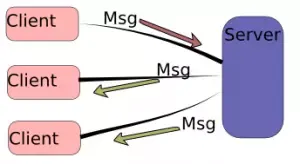

# Simple TCP Server:

This is a simple tcp server that I have created. The purpose of this project was to familiraize myself with websockets and intro into networking.

This was quite a fun project, albiet quite easy, so I don't doubt that anyone in the future who looks at this code will find it rudimentary and easy, but honestly, this was an exercise of the mind, to learn what little I can before we delegate that task to LLM's.

---
### The Files and their associated uses:

# Server.py:
This is the brains of the operation. The task of this file is simple, to create a localhost server that clients can bind to.

We used threading to ensure that no blocking code was causing only one client to come in.

That being said, there is a ton of work left to do on error handling, however for a rudimentary server, this will suffice. In the future, I will be making an advanced TCP chatroom, and we will be error hardening it with closed connections.

--- 
# Client.py:
 This is the client file, we are asked for a name and the messages from other clients are printed here.

 There is much work to be done in the client, one notable error that I wish to have for future verisons is such that when I type a message, the user's name will appear before the message. There was this weird bug that wouldn't let me have it in such a way that the user could see their own "username" with the message they wrote. But alas, that wil be for future iterations.

---
### Final Notes:
I think it takes a lot out of me to find the time to do these projects, and while I might not see tramendous swing day to day, I like to imagine that little by little I am improving.

This is my final send off. From this moment, forward, I am considering this project finished to the scope of what I initially set out.

Kevin Russel: Jan/9/2026.